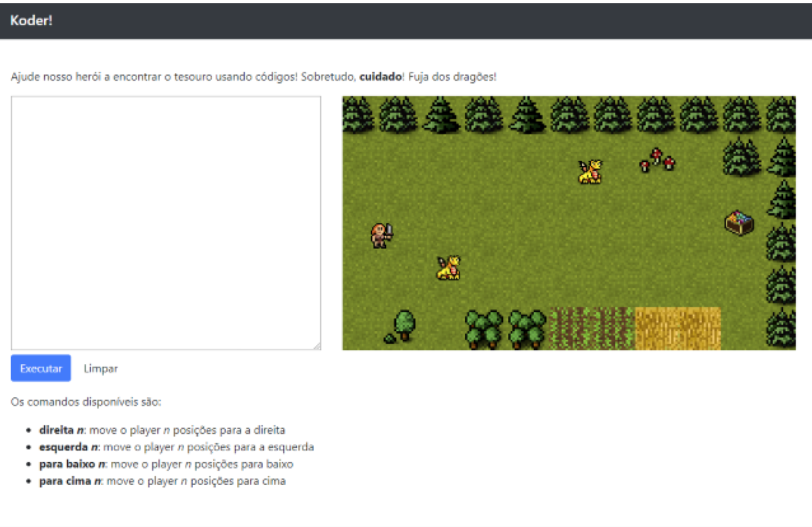

# Koder

*Koder* is a game in which you have to move the player using commands in a programming language. The available commands are:

* `right n`: moves the player `n` units to the right
* `left n`: moves the player `n` units to the left
* `down n`: moves the player `n` units down
* `up n`: moves the player `n` units up

## Example

The following example is a program that moves the player 10 units to the right, 5 units down, 5 units to the left and 5 units up.

```
right 10
down 5
left 5
up 5
```

Koder was created based on a grammar from [**antlr**](http://antlr.org). It is available in the file [grammar/Koder.g4](grammar/Koder.g4)

Koder uses the *visitor* pattern to cycle through the AST generated by the parser from the input and performs actions in the context of a game that is implemented using [**phaser**](http://phaser.io).

The result is an HTML game whose mechanics of controls involve moving the player using the programming language commands. The following figure illustrates the game screen.



## Tools

For the software to work it is necessary to download the [ANTLR runtime for JavaScript](https://www.antlr.org/download/antlr-javascript-runtime-4.7.2.zip) and also use a web server for static files (such as * HttpServer * or the * Live Server * extension for VSCode).

The runtime must be unzipped in the software's root folder (creating the `./Antlr4` path).

The software also uses the * require.js * library available in the [antlr] repository (it is not download it as it is already in `./lib/require.js`).

## Note

This software is a demonstration of the concepts of compilers and the use of ANTLR to create them (lexical analysis, parsing, semantic analysis, grammar).

[antlr]: https://github.com/antlr/antlr4/blob/master/runtime/JavaScript/src/lib/require.js
